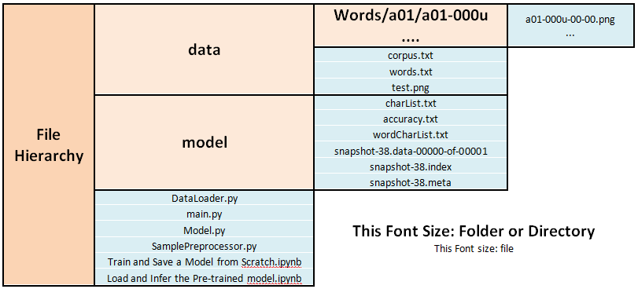
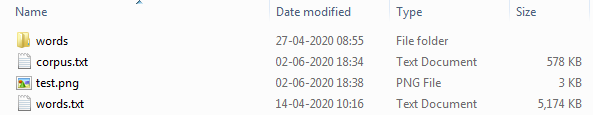
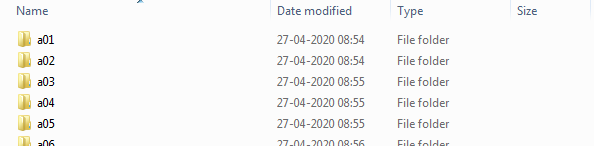
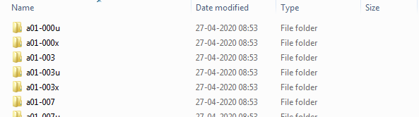
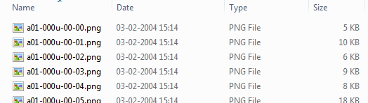

# Handwritten-Text-Recognition-using-Tensorflow-in-Jupyter-Notebook
This Repository shows the workdone of Harald Scheidl in Jupyter Notebook. 
Some documents are directly imported from githubharald/SimpleHTR a github account of Herald Scheidl
(https://github.com/githubharald/SimpleHTR)
## Data Set:
Get IAM dataset
1. Register at: http://www.fki.inf.unibe.ch/databases/iam-handwriting-database
2. Download words.tgz 
3. Download words.txt
4. Put words.txt into this dir
5. Create subdir words
6. Put content (directories a01, a02, ...) of words.tgz into subdir words

Check if dir structure looks like this:

            data
            --test.png
            --words.txt
            --words
            ----a01
            ------a01-000u
            --------a01-000u-00-00.png
            --------...
            ------...
            ----a02
            ----...
## File Management Structure:

### inside data/

### inside data/words/

### inside data/words/a01/

### inside data/words/a01/a01-000u/

# Steps to Follow:
     1.  Open "Train and Save a Model from Scratch.ipynb" file in Jupyter notebook and execute each cell serially.
         This will cause training of model and saving it inside 'model/' directory.
     2.  After training, check the 'model/' directory and make sure a three new file begining with name 'snapshot'
         recently formed inside it.
     3.  Open "Load and Infer the Pre-trained model.ipynb" file in Jupyter notebook and execute each cell serially.
         This will help us to load the model by importing the required snapshot*** file from 'model/' directory.
         It also help us to infer a handwritten image stored in 'data/' with a name 'test.png'.
